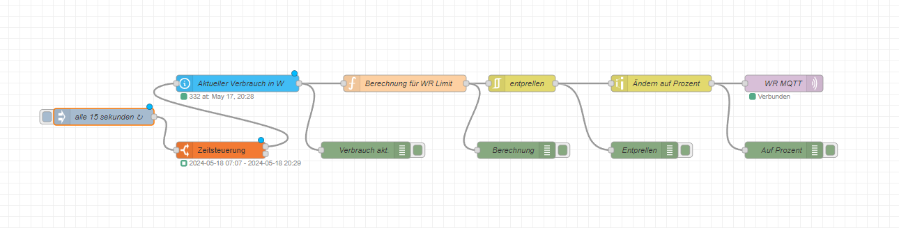

# Nulleinspeisung-Node-RED | OpenDTU | MQTT 

## Erklärung
Eine Nulleinspeisung bedeutet, dass die Photovoltaikanlage keine Energie ins öffentliche Stromnetz einspeist. Dies wird erreicht, 
indem die Einspeiseleistung der PV-Anlage auf den aktuellen Stromverbrauch des Haushalts begrenzt wird.
Mit Hilfe von Node-RED, OpenDTU und MQTT kann eine solche dynamische Leistungsbegrenzung realisiert werden.

**Wichtig: Ich übernehme keinerlei Haftung für Schäden oder Verluste, die durch die Nutzung dieses Projekt entstehen könnten!**

## Voraussetzungen
- [Node-RED](https://github.com/node-red/node-red?tab=readme-ov-file)
- [Aktueller Stromverbauch ist auslesbar (Tasmota IR Lesekopf)](https://tasmota.github.io/docs/Smart-Meter-Interface/)
- [Euer Wechselrichter kann Limitiert werden (per MQTT)](https://tasmota.github.io/docs/Smart-Meter-Interface/)
- [ESP-32 mit OpenDTU](https://github.com/tbnobody/OpenDTU)

## Funktionsweise

Dieses Node-RED-Skript ist ein Flow, der den aktuellen Stromverbrauch eines Haushalts überwacht und basierend darauf die Leistungsgrenze eines Wechselrichters dynamisch anpasst.
Funktionsweise
  1. Das Skript löst alle 15 Sekunden einen neuen Durchlauf des Flows aus.
  2. Eine Zeitabfrage überprüft, ob die aktuelle Zeit zwischen Sonnenaufgang + 2 Stunden und Sonnenuntergang - 30 Minuten liegt. Wenn ja, wird der Flow fortgesetzt, ansonsten nicht.
  3. Der Aktuelle Verbrauch in W ruft den aktuellen Stromverbrauch des Haushalts von dem Tasmota IR Lesekopf ab. Dies ist der Wert des Sensors sensor.tasmota_lk13be_power_curr.
  4. Die Funktion berechnet basierend auf dem aktuellen Verbrauch eine neue Leistungsgrenze für den Wechselrichter.
       - Die maximale Leistung des Wechselrichters ist 1500 Watt oder einen andern beliebigen Wert.
       - Die aktuelle Leistungsgrenze wird aus dem Node-Kontext geladen oder auf den Maximalwert gesetzt.
       - Der aktuelle Verbrauch wird zur Leistungsgrenze addiert.
       - Die Leistungsgrenze wird auf den Bereich 0-1500 Watt begrenzt.
       - Die neue Leistungsgrenze wird im Node-Kontext gespeichert und ausgegeben.
  5. Der rbe-Node entprellt die Leistungsgrenze, um zu häufige Änderungen zu vermeiden.
  6. Der range-Node skaliert die Leistungsgrenze von 0-1500 Watt auf 8-100 Prozent.
  7. Der mqtt out-Node sendet die skalierte Leistungsgrenze als Prozentsatz an den Wechselrichter über MQTT mit dem Topic `solar/SERIENNUMMER_DES_WECHSELRICHTERS/cmd/limit_nonpersistent_relative`.

## NodeRED Flow



```code
[{"id":"b25cd44df48429b5","type":"tab","label":"Flow 1","disabled":true,"info":"","env":[]},{"id":"176d8c7d11a5c0d1","type":"mqtt out","z":"b25cd44df48429b5","name":"WR MQTT","topic":"solar/SERIENNUMMER_DES_WECHSELRICHTERS/cmd/limit_nonpersistent_relative","qos":"","retain":"","respTopic":"","contentType":"","userProps":"","correl":"","expiry":"","broker":"87b2d138566ff5cc","x":1670,"y":320,"wires":[]},{"id":"a1a3647f577a1900","type":"inject","z":"b25cd44df48429b5","name":"alle 15 sekunden","props":[{"p":"payload"},{"p":"topic","vt":"str"}],"repeat":"16","crontab":"","once":false,"onceDelay":0.1,"topic":"","payload":"","payloadType":"date","x":130,"y":320,"wires":[["7bbf98821b7d784c"]]},{"id":"703d1fe697175c20","type":"function","z":"b25cd44df48429b5","name":"Berechnung für WR Limit","func":"// MAX generation of the inverter Watts\nvar maxPower = 1500;\n\n// Get current power limit or default\nvar power = context.get('power') || maxPower;\npower += msg.payload;\n\n// clamp power between 0 and max\nif (power > maxPower) power = maxPower;\nif (power < 0) power = 1;\n\n\n// store current powerlimit and update message\ncontext.set('power', power);\nmsg.payload = power;\n\nreturn msg;","outputs":1,"timeout":"","noerr":0,"initialize":"","finalize":"","libs":[],"x":990,"y":320,"wires":[["c1b6b5ab6f5d47d4","b0c2e49e6d7dd9da"]]},{"id":"905059e3e97e32e9","type":"api-current-state","z":"b25cd44df48429b5","name":"Aktueller Verbrauch in W","server":"64eac69f.fe1218","version":3,"outputs":1,"halt_if":"","halt_if_type":"str","halt_if_compare":"is","entity_id":"sensor.tasmota_lk13be_power_curr","state_type":"num","blockInputOverrides":false,"outputProperties":[{"property":"payload","propertyType":"msg","value":"","valueType":"entityState"},{"property":"data","propertyType":"msg","value":"","valueType":"entity"}],"for":"0","forType":"num","forUnits":"minutes","override_topic":false,"state_location":"payload","override_payload":"msg","entity_location":"data","override_data":"msg","x":670,"y":320,"wires":[["703d1fe697175c20","dfb1de93b5139f49"]]},{"id":"c1b6b5ab6f5d47d4","type":"rbe","z":"b25cd44df48429b5","name":"entprellen","func":"deadband","gap":"30","start":"","inout":"in","septopics":false,"property":"payload","topi":"topic","x":1200,"y":320,"wires":[["46dd59a169196802","7e02cb429a063346"]]},{"id":"b0c2e49e6d7dd9da","type":"debug","z":"b25cd44df48429b5","name":"Berechnung","active":true,"tosidebar":true,"console":false,"tostatus":false,"complete":"payload","targetType":"msg","statusVal":"","statusType":"auto","x":1190,"y":440,"wires":[]},{"id":"dfb1de93b5139f49","type":"debug","z":"b25cd44df48429b5","name":"Verbrauch akt.","active":true,"tosidebar":true,"console":false,"tostatus":false,"complete":"payload","targetType":"msg","statusVal":"","statusType":"auto","x":920,"y":440,"wires":[]},{"id":"7bbf98821b7d784c","type":"time-range-switch","z":"b25cd44df48429b5","name":"Zeitsteuerung","lat":"52.199424","lon":"13.4742016","startTime":"sunrise","endTime":"sunset","startOffset":"120","endOffset":"-30","x":380,"y":280,"wires":[["905059e3e97e32e9"],[]]},{"id":"46dd59a169196802","type":"debug","z":"b25cd44df48429b5","name":"Entprellen","active":true,"tosidebar":true,"console":false,"tostatus":false,"complete":"payload","targetType":"msg","statusVal":"","statusType":"auto","x":1420,"y":440,"wires":[]},{"id":"7e02cb429a063346","type":"range","z":"b25cd44df48429b5","minin":"0","maxin":"1500","minout":"8","maxout":"100","action":"scale","round":true,"property":"payload","name":"Ändern auf Prozent","x":1450,"y":320,"wires":[["f3280877d71191df","176d8c7d11a5c0d1"]]},{"id":"f3280877d71191df","type":"debug","z":"b25cd44df48429b5","name":"Auf Prozent","active":true,"tosidebar":true,"console":false,"tostatus":false,"complete":"payload","targetType":"msg","statusVal":"","statusType":"auto","x":1670,"y":440,"wires":[]},{"id":"87b2d138566ff5cc","type":"mqtt-broker","name":"","broker":"192.168.188.88","port":"1883","clientid":"","autoConnect":true,"usetls":false,"protocolVersion":"4","keepalive":"60","cleansession":true,"autoUnsubscribe":true,"birthTopic":"","birthQos":"0","birthPayload":"","birthMsg":{},"closeTopic":"","closeQos":"0","closePayload":"","closeMsg":{},"willTopic":"","willQos":"0","willPayload":"","willMsg":{},"userProps":"","sessionExpiry":""},{"id":"64eac69f.fe1218","type":"server","name":"Home Assistant","version":5,"addon":true,"rejectUnauthorizedCerts":true,"ha_boolean":"y|yes|true|on|home|open","connectionDelay":true,"cacheJson":true,"heartbeat":false,"heartbeatInterval":30,"areaSelector":"friendlyName","deviceSelector":"friendlyName","entitySelector":"friendlyName","statusSeparator":"at: ","statusYear":"hidden","statusMonth":"short","statusDay":"numeric","statusHourCycle":"h23","statusTimeFormat":"h:m","enableGlobalContextStore":true}]
```

Bei fragen nutzt gerne das Forum von Simon42. [Nulleinspeisung PV mit Node-Red](https://community.simon42.com/t/nulleinspeisung-pv-mit-node-red/615)
Danke an [usekevin](https://community.simon42.com/u/usekevin/summary) der das ganze ermöglicht hat. <3
